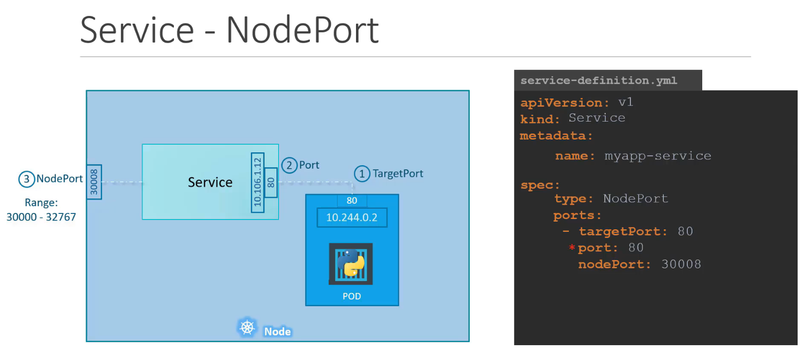

## Deploy and Delete Commands 

Make sure your cursor is under `k8s` folder  

### Deploy 

    kubectl create -f mongo.yml && kubectl create -f kafka.yml && sleep 30 && 
    kubectl create -f data-via-kafka.yml && sleep 30 && 
    kubectl create -f data-consumer.yml && kubectl create -f data-csv.yml &&
    kubectl create -f data-ai.yml

### Delete 

    echo 'Delete Mongo'
    kubectl delete deployment mongo-deployment -n mercury-microservice 
    kubectl delete service mongo-service -n mercury-microservice
    kubectl delete persistentvolumeclaim mongo-data-pvc-mercury -n mercury-microservice  
    kubectl delete persistentvolume mongo-data-pv-mercury 
    
    echo 'Delete Kafka'
    kubectl delete serviceaccount kafka -n mercury-microservice
    kubectl delete service kafka-headless -n mercury-microservice
    kubectl delete statefulset kafka -n mercury-microservice

    echo 'Delete data-via-kafka'
    kubectl delete service via-kafka-service -n mercury-microservice
    kubectl delete deployment via-kafka-deployment -n mercury-microservice
    
    echo 'Delete data-consumer'
    kubectl delete service consumer-service -n mercury-microservice
    kubectl delete deployment consumer-deployment -n mercury-microservice

    echo 'Delete data-csv'
    kubectl delete service csv-service -n mercury-microservice
    kubectl delete deployment csv-deployment -n mercury-microservice

    echo 'Delete data-ai'
    kubectl delete service ai-service -n mercury-microservice
    kubectl delete deployment ai-deployment -n mercury-microservice

### Logs 
    
    echo "Logs"
    kubectl logs deployment.apps/consumer-deployment -n mercury-microservice
    kubectl logs deployment.apps/via-kafka-deployment -n mercury-microservice
    kubectl logs deployment.apps/csv-deployment -n mercury-microservice
    kubectl logs kafka-0 -n mercury-microservice
    
### Connect bash pod
    
    kubectl exec -it consumer-deployment-<id> /bin/sh -n mercury-microservice
    kubectl exec -it kafka-0 /bin/sh -n mercury-microservice
    kubectl exec -it mongo-deployment-<id> /bin/sh -n mercury-microservice
    kubectl exec -it -c busybox nginx-busybox -- /bin/sh

- All pods - `kubectl get pods --all-namespaces`
- Port of pod - `kubectl get pod kafka-0 --template='{{(index (index .spec.containers 0).ports 0).containerPort}}{{"\n"}}' -n mercury-microservice`
- Port forward local port
  - `kubectl port-forward service/mongo 28015:27017`
  - `kubectl port-forward deployment/mongo :27017`
- [More Port Forwarding](https://kubernetes.io/docs/tasks/access-application-cluster/port-forward-access-application-cluster/)

    kubectl port-forward service/kafka-headless 28015:27017

### Describe

    kubectl describe service kafka-headless -n mercury-microservice

### URL

    minikube service -n mercury-microservice --url kafka-headless 

[//]: # (kubectl logs deployment.apps/kafka-deployment -n mercury-microservice)

#### Get SHA256

    docker images --no-trunc --quiet 10austin/data-consumer
    sha256:d08ce4b71db81c6d9c7ec32b6b0d74875c9d632f3d8c2486219280eeb0ce6c58

#### Tunnel (Does not work)

    $ minikube ssh
    docker@minikube:~$ sudo su -
    root@minikube:~# passwd docker
    New password:    # <-- you can set any password
    Retype new password:
    passwd: password updated successfully
    root@minikube:~# logout
    docker@minikube:~$ logout
    $ minikube tunnel
    Starting tunnel for service balanced.
    docker@127.0.0.1's password:  # <-- this should accept above password

### Refer Image

Image below showing mapping port and container port [Image referred link](https://kodekloud.com/blog/clusterip-nodeport-loadbalancer/)

